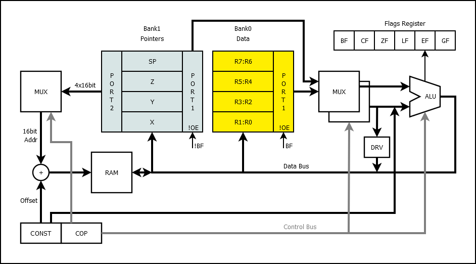

# 74HCPU

Not a very scary instruction set discrete logic processor.

* 8 bit data
* 16 bit address / 64KB RAM
* 16 instructions
* 8 data registers and 4 pointer registers in 2 banks
* 1 flag register in IO port

## How CPU works?

[Layers of PCBs](layers/README.md)
